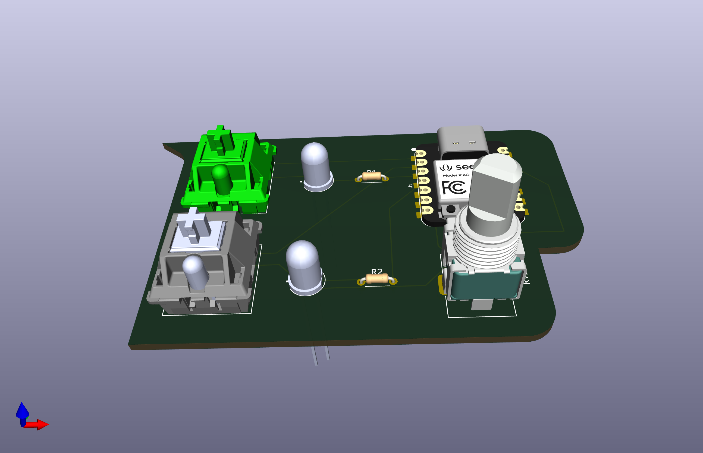
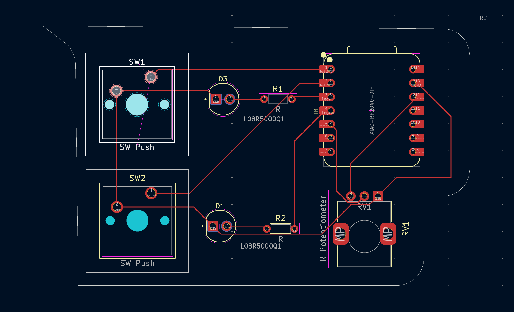
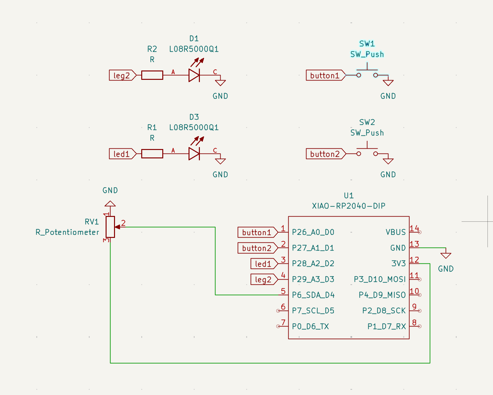

# Pathfinder – Tiny Reaction Game!

Hello!! 
This is my Hack Club Stasis project  its based on reaction time and a bit of fun

---

## How It Works

- LEDs blink
- You press buttons 
- Turn the knob
- Try to react FAST!!

### Rules:
- Press button 1 -> led 1 lights up 
- Press button 2 -> quickly after btn1 -> builds combo both will get on
- if you press button 2 quickly and multiple times then led2 turns on
- Too slow? nothing happens

---

## Images

### 3D View


### Circuit


### Schematic


---

## Components

- LEDs 
- Resistors 
- Xiao RP2040 
- Cherry MX switches 
- PCB 
- Potentiometer (knob!!) 

---


## Code

```cpp
int btn1 = D0;
int btn2 = D1;
int led1 = D2;
int led2 = D3;

int potentio = D4;

long btn2cnt = 0;
long button1time = 0;
long button2time = 0;

void setup() {
  pinMode(btn1, INPUT_PULLUP);
  pinMode(btn2, INPUT_PULLUP);
  pinMode(potentio, INPUT);

  pinMode(led1, OUTPUT);
  pinMode(led2, OUTPUT);
}

void loop() {

  int pot_reading = analogRead(potentio);
  int brightness = map(pot_reading, 0, 1023, 0, 255);

  if (digitalRead(btn1) == LOW) {
    button1time = millis();
    analogWrite(led1, brightness);
  } else {
    analogWrite(led1, 0);
  }

  if (digitalRead(btn2) == LOW) {
    button2time = millis();
    btn2cnt += 1;
  }

  if (abs(button1time - button2time) <= 1000) {
    if (btn2cnt > 2) {
      analogWrite(led2, brightness);
      btn2cnt = 0;
    }
  } else {
    analogWrite(led2, 0);
  }
}